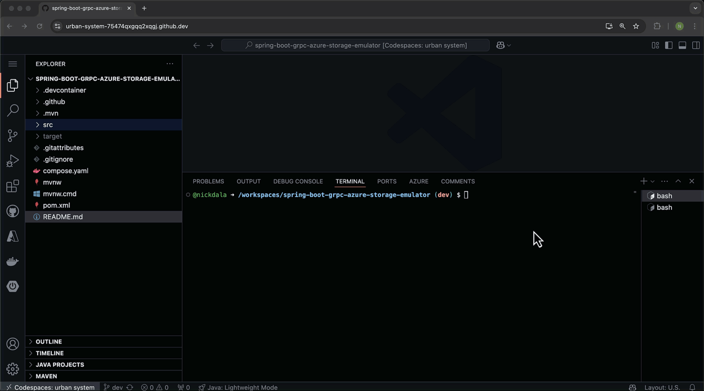

# Azure Storage Emulator example with Spring Boot and gRPC

This is a sample [Spring Boot](https://docs.spring.io/spring-boot/index.html) application that exposes a [gRPC](https://grpc.io/) service to interact with the [Azure Storage Emulator](https://learn.microsoft.com/azure/storage/common/storage-use-azurite?tabs=visual-studio%2Cblob-storage).

## Architecture

The application has the following components:

- **Azure Storage Emulator**: A local emulator that provides a local development environment for Azure Storage.
- **gRPC Service**: A gRPC service that exposes methods to upload, download, and list files in the Azure Storage Emulator.

### Azure Storage Emulator

The Azure Storage Emulator is a local emulator that provides a local development environment for Azure Storage. The Azure Storage service is exposed by the docker compose file `compose.yaml`.

```yaml
services:
  azurite:
    image: 'mcr.microsoft.com/azure-storage/azurite:latest'
    ports:
      - '10000'
      - '10001'
      - '10002'
```

The application uses the `Spring Cloud Azure Storage Starter` to interact with the Azure Storage Emulator. The following dependency is added to the `pom.xml` file:

```xml
<dependency>
  <groupId>com.azure.spring</groupId>
  <artifactId>spring-cloud-azure-starter-storage</artifactId>
</dependency>
```

To use the Azure Storage Emulator, configure the application by setting the following properties in the `application.properties` file:

```yaml
spring.cloud.azure.storage.blob.container-name=contoso
spring.cloud.azure.storage.blob.connection-string=DefaultEndpointsProtocol=http;AccountName=devstoreaccount1;AccountKey=Eby8vdM02xNOcqFlqUwJPLlmEtlCDXJ1OUzFT50uSRZ6IFsuFq2UVErCz4I6tq/K1SZFPTOtr/KBHBeksoGMGw==;BlobEndpoint=http://127.0.0.1:10000/devstoreaccount1;
```

In production, these properties should not be hardcoded in the `application.properties` file. Connection strings in production should be replaced with Microsoft Managed Identity when possible. For more information on Azure Storage support using Microsoft Entra ID, check out the link [here]( https://learn.microsoft.com/azure/storage/blobs/authorize-access-azure-active-directory).

### gRPC Service

The application exposes a gRPC service with the following methods:

- `Upload`: Uploads a file to the Azure Storage Emulator.
- `Download`: Downloads a file from the Azure Storage Emulator.
- `ListFiles`: Lists all files in the Azure Storage Emulator.

The gRPC service is defined in the `proto` folder and is generated by the `protobuf-maven-plugin` plugin. The `storage.proto` file defines the following messages and service that correspond to the methods described above.

```proto
message UploadRequest {
  string file_name = 1;
  string file_content = 2;
}

message UploadResponse {
  string message = 1;
}

message DownloadRequest {
  string file_name = 1;
}

message DownloadResponse {
  string file_content = 1;
}

message ListFilesRequest {
}

message ListFilesResponse {
  repeated string file_names = 1;
}
```

```proto
service StorageService {
  rpc Upload (UploadRequest) returns (UploadResponse);
  rpc Download (DownloadRequest) returns (DownloadResponse);
  rpc ListFiles (ListFilesRequest) returns (ListFilesResponse);
}
```

### Interacting with Azure Blob Storage

Spring provides a [Spring Resource](https://docs.spring.io/spring-framework/docs/current/reference/html/core.html#resources) abstraction to access low level resources. [Spring Cloud Azure](https://learn.microsoft.com/azure/developer/java/spring-framework/developer-guide-overview) implements these interfaces for Azure Storage services.

The `AzureStorageService` class provides methods to upload, download, and list files in the Azure Storage Emulator. The `ResourceLoader` is injected into the `AzureStorageService` class and is used to read and write to blob storage. The pattern `azure-blob://[your-container-name]/[your-blob-name]` is used by the `ResourceLoader` to interact with Azure Blob Storage. Here is how the `AzureStorageService` class is defined:

Fields:

```java
private static final String BLOB_RESOURCE_PATTERN = "azure-blob://%s/%s";

private final ResourceLoader resourceLoader;
private final String containerName; 
```

Constructor:

```java
public AzureStorageEmulatorGrpcService(ResourceLoader resourceLoader,
                                       @Value("${spring.cloud.azure.storage.blob.container-name}") String containerName,
                                       AzureStorageBlobProtocolResolver azureStorageBlobProtocolResolver) {
  this.resourceLoader = resourceLoader;
  this.containerName = containerName;
  this.azureStorageBlobProtocolResolver = azureStorageBlobProtocolResolver;
}
```

The container name is injected from the `application.properties` file.

#### Upload File

Below demonstrates how you can use the `resourceLoader` to write to Azure Blob Storage.

```java
public void upload(UploadRequest request, StreamObserver<UploadResponse> responseObserver) {
  Resource resource = resourceLoader.getResource(String.format(BLOB_RESOURCE_PATTERN, this.containerName, request.getFileName()));

  try (OutputStream os = ((WritableResource) resource).getOutputStream()) {
    os.write(request.getFileContent().getBytes(Charset.defaultCharset()));

    UploadResponse response = UploadResponse.newBuilder()
      .setMessage("File uploaded successfully")
      .build();
    responseObserver.onNext(response);
    responseObserver.onCompleted();
  } catch (IOException e) {
    responseObserver.onError(e);
  }
}
```

#### Download File

Similarly, you can use the `resourceLoader` to read from Azure Blob Storage. The `getInputStream` method is used to read the file content. In this example, the file content is read as a string.

```java
public void download(DownloadRequest request, StreamObserver<DownloadResponse> responseObserver) {
  Resource resource = resourceLoader.getResource(String.format(BLOB_RESOURCE_PATTERN, this.containerName, request.getFileName()));
  
  try (InputStream is = resource.getInputStream()) {
    String fileContent = StreamUtils.copyToString(is, Charset.defaultCharset());
    DownloadResponse response = DownloadResponse.newBuilder()
      .setFileContent(fileContent)
      .build();
    responseObserver.onNext(response);
    responseObserver.onCompleted();
  } catch (IOException e) {
    responseObserver.onError(e);
  }
}
```

#### List Files

`AzureStorageBlobProtocolResolver` is used to search for blob resources. For more information about pattern matching, check out the link [here](https://learn.microsoft.com/azure/developer/java/spring-framework/resource-handling#get-resources-by-searching-pattern).

```java
public void listFiles(ListFilesRequest request, StreamObserver<ListFilesResponse> responseObserver) {

  try {
    Resource[] resources = azureStorageBlobProtocolResolver.getResources(String.format(BLOB_RESOURCE_PATTERN, this.containerName, "*"));
    
    List<String> fileNames = Stream.of(resources).map(Resource::getFilename).toList();
    ListFilesResponse response = ListFilesResponse.newBuilder()
      .addAllFileNames(fileNames)
      .build();
    responseObserver.onNext(response);
    responseObserver.onCompleted();
  } catch (IOException e) {
    responseObserver.onError(e);
  }
}
```

## Build and Run the Application

### Prerequisites

- [Java 21](https://www.oracle.com/java/technologies/downloads/#java21)
- [Docker](https://www.docker.com/)
- [grpcurl](https://github.com/fullstorydev/grpcurl)

There is a [Dev Container](https://code.visualstudio.com/docs/remote/containers) that can be used to build and run the project in a container. This is useful if you don't have the prerequisites installed on your machine. You can open the project in Visual Studio Code and select the "Reopen in Container" option. Or you can use [CodeSpaces](https://github.com/features/codespaces) to build the project in the cloud.

### Build

Build the project with Maven:

```
./mvnw clean package
```

### Run the Application

Run the application:

```
./mvnw spring-boot:run
```

## Testing the gRPC Service

The following should be executed in a terminal after the application is running using `./mvnw spring-boot:run`. The application will be running and the gRPC service is exposed on port 9090.

### Verify Azurite emulator for local Azure Storage development is running

First verify that the Azurite container is running by running the following command:

```
docker ps
```

You should see the following output:

```
CONTAINER ID  IMAGE  COMMAND  CREATED  STATUS  PORTS  NAMES

7f6caeb1e3f4  mcr.microsoft.com/azure-storage/azurite:latest  "docker-entrypoint.s…"  6 hours ago  Up 5 seconds  0.0.0.0:32768->10000/tcp, [::]:32768->10000/tcp, 0.0.0.0:32769->10001/tcp, [::]:32769->10001/tcp, 0.0.0.0:32770->10002/tcp, [::]:32770->10002/tcp spring-boot-grpc-azure-storage-emulator-azurite-1 
```

### Test the gRPC Service

You can test the gRPC service with `grpcurl`.

#### Upload File

```
grpcurl -plaintext -d '{"file_name": "sample1.txt", "file_content": "hello azure storage"}' \
  localhost:9090 storage.v1.StorageService/Upload
```

Response:

```json
{
  "message": "File uploaded successfully"
}
```

#### Download File

```
grpcurl -plaintext -d '{"file_name": "sample1.txt"}' \
  localhost:9090 storage.v1.StorageService/Download
```

Response:

```json
{
  "file_content": "hello azure storage"
}
```

#### List Files

```
grpcurl -plaintext localhost:9090 storage.v1.StorageService/ListFiles     
```

Response:

```json
{
  "file_names": [
    "sample1.txt"
  ]
}
```

## Demo

